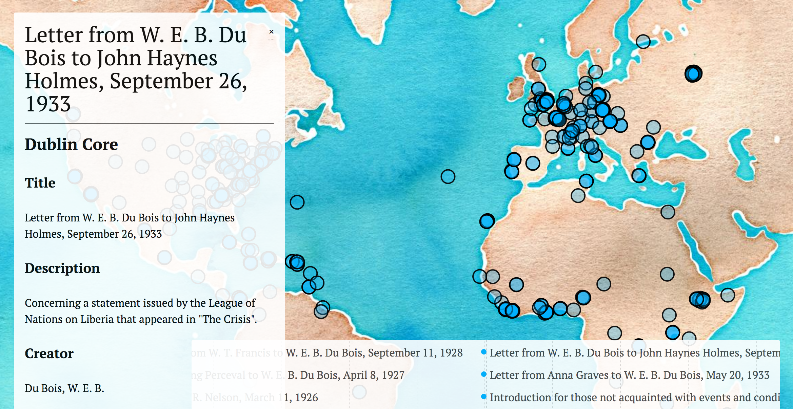

# *Visualizing the Global Du Bois*

[*Visualizing the Global Du Bois*](http://dubois.roopikarisam.com/cms/neatline/fullscreen/test) brings together a series of data visualizations that challenge the long-held belief that W.E.B. Du Bois's investment in decolonization is a later move in his intellectual trajectory. The current prototype is a proof-of-concept for the project, developed in Neatline. The next phase of the project uses D3.js data visualization to trace Du Bois's networks over space and time and examine the citational politics of Du Bois's literary writing that have shaped how the Global Du Bois is interpreted. *Visualizing the Global Du Bois* is being developed as a digital project for Stanford University Press.

